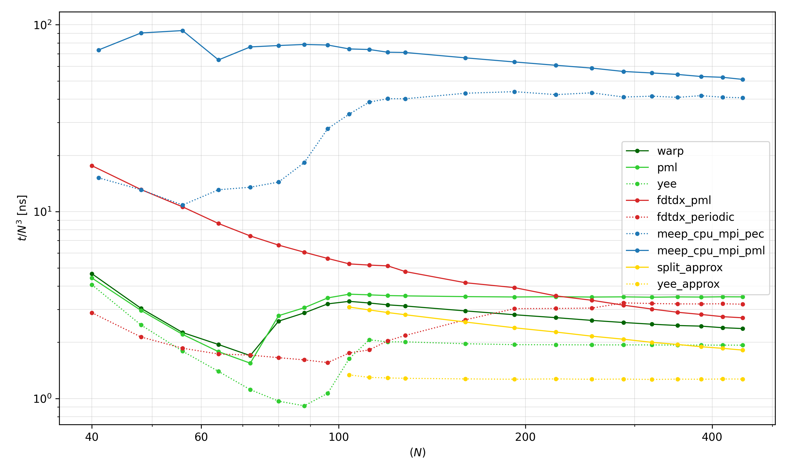

# FDTDW

**GPU-Accelerated Adjoint FDTD Solver for High-Frequency Structures**

FDTDW is a Python-based 3D FDTD solver built on **NVIDIA Warp**. It is designed for the sensitivity analysis of RF components using the adjoint method, enabling gradient-based topology optimization.

### Capabilities
* **GPU Acceleration:** JIT compilation to custom CUDA kernels.
* **Adjoint Sensitivity:** Computes gradients of FOM w.r.t. **permittivity ($\varepsilon$)** and **magnetic permeability ($\mu$)**.
* **Materials:** Supports Perfect Electrical/Magnetic Conductors (PEC/PMC) and linear, diagonal-anisotropic media.
* **Boundaries:** Convolutional Perfectly Matched Layers (CPML) for absorption.
* **DTFT-Analysis:** Detectors and Sources with DFT-Capabilities.

### Limitations
* **Linear and Non-Dispersive:** No support for non-linear and dispersive material models.
* **Manual Gradients:** Does not provide VJP wrappers.

### Installation

```bash
git clone https://github.com/xvr0/FDTDW
cd FDTDW
pip install .
```

### Performance
Time spent per update step and cell for various forward solvers ([Test Scripts](examples/benchmark) run on NVIDIA GTX 4070 Ti Super and Intel i7-14700F for 2000 timesteps).

